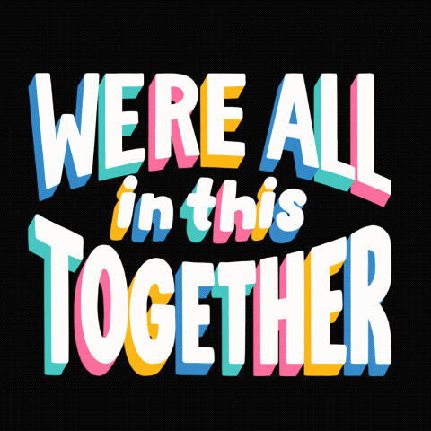

# WordWright

## Inspiration
 

## What it does
>   1. Download the WordWright app.
>   2. Either join an existing game using a game code or create a new game.
>   3. Once in the game room choose one of the 5 themes: Marvel, Game of Thrones, Lord of the Rings, Harry Potter or Chicken Soup.
>   4. A theme related prompt and wordbank appears and the game begins!
>   5. Every player will have 30 seconds to submit a sentence attempting to use as many words as possible from the word bank provided.
>   6. When the time is up the collaborative story will appear on the summary page and the player with the most words used is the winner!

## How we built it
* React-Native - for the mobile application framework
* JavaScript - web app development 
* Python - frontend and backend
* Flask - Deploying the models in the backend 
* PyTorch - Natural Language Generation 
* APIs - data collection
* Regular Expression - data cleaning to remove unnecessary punctuations and characters

## Challenges we ran into
>   * Used APIs for data collection that were difficult to use due to lack of proper documentations
>   * Encountered issues with messy data when used for NLG model
>   * Deploying models in the backend
>   * Deploying the app with Heroku using Flask and React
>   * Time constraint 
>   * Setting up backend architecture to keep track of rooms and users
>   * Qualifying language that evokes togetherness

## Accomplishments that we're proud of
>   * Collected substantial amount of data using API calls
>   * Utilized a Natural Language Generator (NLG) using Pytorch to produce a prompt for each category
>   * Generated a word bank containing words that represent each writing category 
>   * Partially completed an interactive story writing web application using tools such as React and Flask
>   * Cleaned messy datasets using Regular Expressions
>   * Worked together as a team 
>   * Spent more than 50 hours on the project
>   * Learned new methods
>   * Reflecting togetherness through the game design

## What we learned
>   * Better communication between frontend and backend development early on
>   * Improve how to clean and reorganize messy datasets
>   * How to create backend logic for keeping track of several games and users at once 
>   * How to better store models web app deployment 
>   * How Natural Language Generators (NLG) models work

## What's next for WordWright
> Our team will continue working on deploying the model, ... in order to produce the final story writing web app. We will also consider adding more writing categories and 

# Template React + Flask framework

Created and maintained by: TheReddKing (TechX)

## Dev:

### Setting Up Front End

    cd client
    npm install
    

### Local Installation:

    python -m venv env
    source env/bin/activate
    pip install --upgrade pip
    pip install -r requirements.txt
    yarn
    cp .env.example .env
    (cd client && yarn)

Then edit your `.env` file. Once your database url is correct (you can use `createdb template` if you have postgres)

    python manage.py db init
    python manage.py db migrate
    python manage.py db upgrade

### Dev run

    yarn run dev
    
or (if you want to debug server side scripts)

    yarn start
    yarn run dev-server

### Editing

Look at the HOWTHISWASMADE.md file for more information

## Deploy on HEROKU

You first need to actually create a heroku application. You can also use the `app.json` to deploy (you can read about it somewhere else)

Then you need to copy over the environmental variables from your local computer

    sed 's/#[^("|'')]*$//;s/^#.*$//' .env | \
    xargs heroku config:set

Afterwards, a simple heroku push will configure everything

    git push heroku master
